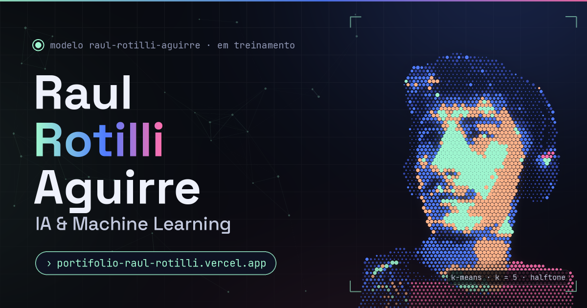

# raul.ai · Portfólio de Raul Rotilli Aguirre

Um portfólio que é, ele mesmo, um experimento de IA. Sou desenvolvedor em formação: comecei pelo back-end (Java e Spring) e hoje direciono meus estudos para **Inteligência Artificial e Machine Learning**. Aqui, o meu retrato nasce do ruído como num modelo de difusão, oito algoritmos o transformam em arte ao vivo, uma rede neural treina na sua frente e um mini RAG responde perguntas sobre mim. Tudo roda no navegador, sem servidor e sem bibliotecas.

**Acesse:** [portifolio-raul-rotilli.vercel.app](https://portifolio-raul-rotilli.vercel.app)



## O que tem aqui

- **Hero de difusão:** milhares de partículas saem do ruído e formam o retrato, passo a passo.
- **Galeria neural:** 8 algoritmos geram retratos em tempo real (K-Means, convolução 2D, SVD, tokenização em ASCII, triangulação de Delaunay, pontilhismo de Voronoi, campo de gradientes e dithering Floyd–Steinberg), com parâmetros ajustáveis, comparação com o original e download em PNG.
- **Playground de rede neural:** forward pass, backpropagation e descida do gradiente escritos do zero, com fronteira de decisão ao vivo em 5 datasets.
- **Corrida de otimizadores:** SGD, Momentum, RMSProp e Adam descendo a mesma superfície de perda.
- **RaulGPT:** um mini RAG com TF-IDF e similaridade de cosseno que responde sobre a minha trajetória, 100% no navegador.
- **Log de treino:** a trajetória contada como épocas, com a curva de perda caindo.
- **Mapa de habilidades:** um mapa 2D ilustrativo, posicionado à mão, no estilo de um espaço de embeddings (habilidades parecidas ficam próximas).
- **Paleta de comandos:** <kbd>Ctrl</kbd> + <kbd>K</kbd> (ou <kbd>/</kbd>) para navegar, abrir obras e disparar ações.
- **Pausar animações:** botão no rodapé (ou na paleta de comandos) para quem prefere menos movimento.
- **Easter egg:** experimente o código Konami (↑ ↑ ↓ ↓ ← → ← → B A).

## Tecnologias

- HTML, CSS e JavaScript puros, **sem dependências** e sem etapa de build.
- Canvas 2D na maioria das visualizações (o log de treino e o mapa de habilidades são SVG); animações pausam fora da tela, respeitam `prefers-reduced-motion` e podem ser pausadas pelo botão no rodapé.
- Foto recortada com a rede de segmentação **IS-Net**; paleta de cores extraída da foto com k-means.
- Deploy estático na Vercel.

## Como rodar localmente

Basta abrir o `index.html` no navegador. Se preferir um servidor local:

```bash
python3 -m http.server 8000
# depois acesse http://localhost:8000
```

## Estrutura

```text
.
├── index.html              # página única com todas as seções
├── assets/                 # retratos, favicon, imagem de compartilhamento (+ ícones do site antigo)
├── js/
│   ├── portrait-data.js    # retrato embutido, carregado só via file:// (onde o canvas não lê arquivos)
│   ├── core.js             # utilitários compartilhados (namespace RR)
│   ├── art/                # uma obra por arquivo: kmeans, convolution, svd, ascii,
│   │                       # delaunay, stipple, flowfield, dither
│   ├── gallery.js          # galeria neural
│   ├── hero.js             # retrato por difusão
│   ├── playground.js       # rede neural treinando ao vivo
│   ├── optimizers.js       # corrida de otimizadores
│   ├── raulgpt.js          # mini RAG
│   ├── timeline.js         # log de treino + embeddings
│   ├── bg-net.js           # constelação neural do fundo
│   ├── palette.js          # paleta de comandos e avisos
│   └── main.js             # cabeçalho, menu, revelação ao rolar, easter egg
├── styles/                 # style.css (design system) + um CSS por módulo
└── pages/                  # redirecionamentos das páginas antigas
```

## Contato

[GitHub](https://github.com/Raul-Rotilli) · [LinkedIn](https://www.linkedin.com/in/raul-rotilli-aguirre/) · [Instagram](https://www.instagram.com/raulrotilli/)
